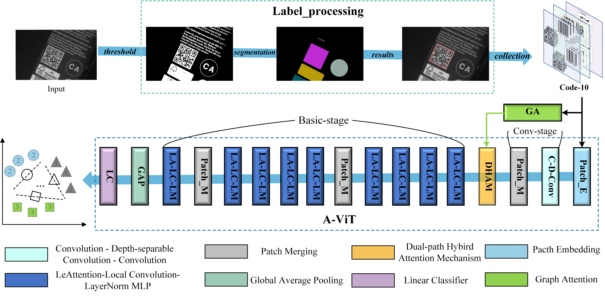

# paper information

**_Alightweight model for label printing defect recognition._**

# Get Started 

## Enviroment

**Python=3.8**

**Packages**:
- torch==
- torchvision==
- numpy==
- opencv-python==
(The above environment configuration is not the optimal result, other environments versions might work too.)

## datasets(DAGM2007*)
The link to the reconstructed DAGM2007 dataset is as follows: [DAGM2007*](https://www.kaggle.com/datasets/amor000/reconstructed-dagm2007-dataset).

## Run

Please specity dataset path and log foder before running.

## Acknowledgement

Thank for great inspiration from [PatchCore]()
